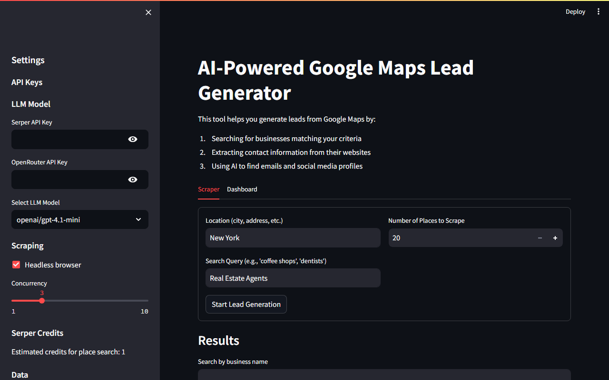

# AI-Powered Google Maps Lead Generator

### Scraper — Input Form


### Results & Dashboard


## What it does
This tool helps you generate business leads from Google Maps by:
1. Searching for businesses matching your criteria (location + query)
2. Scraping their websites to extract contact information
3. Using AI (via OpenRouter) to find emails and social media profiles
4. Finding LinkedIn profiles using Serper API
5. Validating emails and exporting leads to Excel, CSV, or JSON

## Features
- 🔍 **Google Maps scraping** — Search any business type in any city
- 📧 **Email extraction** — Scrapes websites and validates email health (valid / risky / unknown)
- 🔗 **LinkedIn finder** — Auto-searches LinkedIn company/person profiles via Serper
- 📊 **Dashboard** — Charts showing leads collected, email hit rate, and run history
- 🔁 **Retry failed** — Re-runs only businesses where no email was found
- 📤 **Multiple exports** — Download as Excel, CSV, or JSON
- ⚙️ **Configurable** — Headless browser toggle, concurrency (1–10), LLM model selector

## Tech Stack
- **Frontend**: Streamlit
- **Scraping**: Playwright / Selenium (headless browser), BeautifulSoup
- **AI**: OpenRouter API (GPT-4.1-mini, DeepSeek, etc.)
- **Search**: Serper API (Google Search)
- **Data**: Pandas, openpyxl

## Setup

### 1. Clone the repo
```bash
git clone `https://github.com/syedmusadiqhussain/AI-Powered-Google-Maps-Lead-Generator.git`
cd AI-Powered-Google-Maps-Lead-Generator
```

### 2. Install dependencies
```bash
pip install -r requirements.txt
```

### 3. Add your API keys
Copy `.env.example` to `.env` and fill in:
```
SERPER_API_KEY=your_serper_key_here
OPENROUTER_API_KEY=your_openrouter_key_here
```
Or enter them directly in the app sidebar.

### 4. Run the app
```bash
streamlit run app.py
```
Open http://localhost:8501 in your browser.

## Project Structure
```
├── app.py                  # Main Streamlit app
├── main.py                 # Entry point
├── src/
│   ├── business_info.py    # Business data types and enrichment
│   ├── places_api.py       # Google Maps Places scraping
│   ├── web_scraper.py      # Website scraping + email extraction
│   ├── data_export.py      # Excel/CSV/JSON export logic
│   └── utils.py            # LLM invocation helpers
├── data/                   # Output folder (leads saved here)
├── .env.example            # API key template
└── requirements.txt
```

## License
MIT — free to use and modify.
